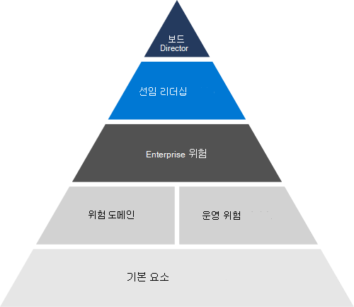

# 리스크 관리 개요

## Microsoft는 기업 전체의 위험을 어떻게 평가하고 관리하나요?

위험 관리는 위험을 식별, 평가 및 대응하는 프로세스입니다. Microsoft의 위험 관리는 새로운 위협을 예상하고 클라우드 시스템과 이를 사용하는 고객에게 지속적인 보안을 제공하도록 고안되었습니다.

Microsoft의 위험 관리 활동은 ERM(Enterprise 관리) 프로그램에서 관리합니다. ERM을 사용하면 전체 엔터프라이즈 위험 관리 프로세스를 사용할 수 있으며 기업 전체의 관리와 함께 Microsoft의 가장 중요한 위험을 식별하고 책임질 수 있습니다. Microsoft의 비즈니스 전략을 알리고 위험을 완화하고 책임감을 주도하기 위해 위험을 예상, 평가 및 보고하는 데 중점을 습니다.

Microsoft ERM은 기업 전체에서 위험 관리 활동을 조정하여 사업부가 일관되고 비교적인 위험 평가를 독립적으로 지원할 수 있도록 합니다. 이러한 조정을 통해 Microsoft는 관리에 대한 통합된 방식으로 위험 정보를 집계하고 보고할 수 있습니다. ERM은 위험 관리 프로세스에 대한 일반적인 방법, 도구 및 목표를 Microsoft의 사업부에 제공합니다. Microsoft 365 및 기타 엔지니어링 그룹 및 사업부는 이러한 도구를 사용하여 ERM의 지침에 따라 자체 위험 관리 프로그램의 일부로 개별 위험 평가를 실시합니다.

## ERM에서 Microsoft 365 어떻게 작동하나요?

Microsoft 365 위험 관리 프로그램은 ERM 지침을 따라 여러 서비스에서 Microsoft 365 관리합니다. 이 프로그램은 기존 Microsoft 365 엔지니어링, 서비스 운영 및 규정 준수 프로세스와 ERM 프레임워크를 맞추는 데 중점을 두어 위험 관리 프로그램을 보다 효과적이고 효율적으로 만듭니다. Microsoft 365 관리 활동은 궁극적으로 ERM 프로세스에 롤업하고 알릴 수 있습니다.

위험 평가 활동의 일부로 Microsoft 365 위험 관리 프로그램은 Microsoft 365 프레임워크(Framework)의 일부로 구현된 컨트롤의 디자인 및 운영 효율성을 분석합니다. 프레임워크는 규정 준수 활동 지원과 함께 적절히 구현될 때 엔지니어링 팀이 주요 규정 및 인증을 준수할 수 있도록 하는 합리화된 제어 집합입니다.

## 온라인 Microsoft 365 어떻게 관리하고 평가하나요?

지속적인 위험 평가 활동의 일부로 Microsoft 365 위험 관리 프로그램은 Microsoft 365 서비스를 디자인, 구축 및 운영하는 서비스 팀과 면접을 수행하여 현재 위험 및 우려 영역을 식별합니다. 지속적인 모니터링 데이터, 감사 및 기타 원본 분석과 함께 이러한 활동은 장기 비즈니스 목표에 대한 현재 및 가능한 미래 위험을 식별하는 위험 평가 보고서를 개발하는 데 사용됩니다. 위험 평가 보고서는 Microsoft 365 팀의 결과 및 피드백을 기반으로 하여 위험 Microsoft 365 개요를 제공합니다. 다른 사업부의 유사한 보고서와 함께 Microsoft 365 위험 평가 보고서는 ERM 프로그램 위험 평가에 기여하고 이를 알릴 수 있습니다.

Microsoft 365 신뢰는 정책 준수, 보안 요구 사항 및 위험 관리와 관련된 보증 작업을 지원하는 그룹입니다. Microsoft 365 신뢰는 새로운 위험을 식별하고 알려진 위험 및 위험 대응을 모니터링합니다. Microsoft 365 서비스 팀의 피드백 및 Microsoft 365 이 프로세스를 알릴 수 있습니다. 위험 대응의 성공 및 실패를 추적하여 위험 가능성 및 영향 분석을 개발하고 알리기 위해 추적됩니다. 위험 소유자와의 정기적인 위험 검토 모임을 통해 Microsoft 365 트러스트를 사용하여 위험 응답을 업데이트하고 관리할 수 있습니다.

## 인증을 위한 & 규정

Microsoft의 온라인 서비스는 외부 규정 및 인증을 준수하도록 정기적으로 감사됩니다. 위험 관리와 관련된 컨트롤의 유효성 검사는 다음 표를 참조합니다.

| **외부 감사** | **섹션** | **최신 보고서 날짜** |
|:--------------------|:------------|:-----------------------|
| [FedRAMP(Office 365)](https://compliance.microsoft.com/compliancemanager) | CA-2: 보안 평가   CA-5: 작업 계획 및 중요 시점   RA-3: 위험 평가 | 2020년 9월 24일 |
| [ISO 27001/27002(Office 365)](https://servicetrust.microsoft.com/ViewPage/MSComplianceGuideV3?command=Download&downloadType=Document&downloadId=8d625374-4f2d-49f8-9d37-a4281ba98222&tab=7027ead0-3d6b-11e9-b9e1-290b1eb4cdeb&docTab=7027ead0-3d6b-11e9-b9e1-290b1eb4cdeb_ISO_Reports)    [적용성 설명](https://servicetrust.microsoft.com/ViewPage/MSComplianceGuideV3?command=Download&downloadType=Document&downloadId=c0df4ce8-c77e-4183-84eb-c8688470d8b1&tab=7027ead0-3d6b-11e9-b9e1-290b1eb4cdeb&docTab=7027ead0-3d6b-11e9-b9e1-290b1eb4cdeb_ISO_Reports)   [인증](https://servicetrust.microsoft.com/ViewPage/MSComplianceGuideV3?command=Download&downloadType=Document&downloadId=1e84a14a-2468-45ac-9412-5e53250d57ec&tab=7027ead0-3d6b-11e9-b9e1-290b1eb4cdeb&docTab=7027ead0-3d6b-11e9-b9e1-290b1eb4cdeb_ISO_Reports) | A.5: 정보 보안 정책 | 2021년 4월 20일 |
| [ISO 27017(Office 365)](https://servicetrust.microsoft.com/ViewPage/MSComplianceGuideV3?command=Download&downloadType=Document&downloadId=8d625374-4f2d-49f8-9d37-a4281ba98222&tab=7027ead0-3d6b-11e9-b9e1-290b1eb4cdeb&docTab=7027ead0-3d6b-11e9-b9e1-290b1eb4cdeb_ISO_Reports)    [적용성 설명](https://servicetrust.microsoft.com/ViewPage/MSComplianceGuideV3?command=Download&downloadType=Document&downloadId=c0df4ce8-c77e-4183-84eb-c8688470d8b1&tab=7027ead0-3d6b-11e9-b9e1-290b1eb4cdeb&docTab=7027ead0-3d6b-11e9-b9e1-290b1eb4cdeb_ISO_Reports)   [인증](https://servicetrust.microsoft.com/ViewPage/MSComplianceGuideV3?command=Download&downloadType=Document&downloadId=70de0999-5451-43a3-9ef4-761e8fbfb1a3&tab=7027ead0-3d6b-11e9-b9e1-290b1eb4cdeb&docTab=7027ead0-3d6b-11e9-b9e1-290b1eb4cdeb_ISO_Reports) | A.5: 정보 보안 정책 | 2021년 4월 20일 |
| [SOC 1(Office 365)](https://servicetrust.microsoft.com/ViewPage/MSComplianceGuideV3?command=Download&downloadType=Document&downloadId=90df3f9c-3aaf-4dbf-99d0-ca9f2991721b&tab=7027ead0-3d6b-11e9-b9e1-290b1eb4cdeb&docTab=7027ead0-3d6b-11e9-b9e1-290b1eb4cdeb_SOC_%2F_SSAE_16_Reports) | CA-03: 위험 관리 | 2020년 12월 24일 |
| [SOC 2(Office 365)](https://servicetrust.microsoft.com/ViewPage/MSComplianceGuideV3?command=Download&downloadType=Document&downloadId=a73c1738-7892-42b7-acd3-87b6371c53f6&tab=7027ead0-3d6b-11e9-b9e1-290b1eb4cdeb&docTab=7027ead0-3d6b-11e9-b9e1-290b1eb4cdeb_SOC_%2F_SSAE_16_Reports) | CA-02: 거버넌스, 위험 및 규정 준수 팀 책임   CA-03: 위험 관리   CA-17: Microsoft 보안 정책   CA-24: 내부 위험 평가 | 2020년 12월 24일 |
